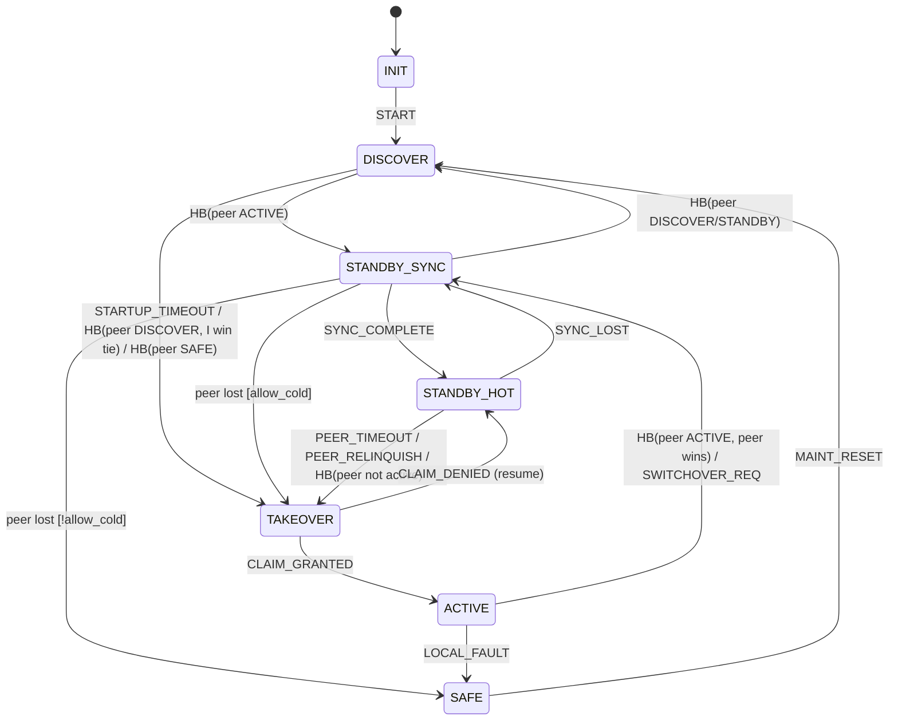

# State machine

The redundancy behaviour of a node is defined entirely by the pure function
`rdn_fsm_step(state, event, peer) -> (state', actions)` in
[`src/rdn_fsm.c`](../src/rdn_fsm.c). It performs no I/O. The runtime
(`src/rdn_core.c`) turns observations into events and executes the returned
actions in a fixed order.

The table below is the specification. Every row is checked by
`test_transition_table` in [`tests/test_fsm.c`](../tests/test_fsm.c).
The structural invariants are checked exhaustively over all
state × event × peer-view combinations (`test_exhaustive_invariants`).
If you change a row here, change the code and the test table together.

## States

| State | Meaning | Outputs | Replica |
|---|---|---|---|
| `INIT` | Created, not started | off | n/a |
| `DISCOVER` | Listening for the peer; role not decided | off | not valid |
| `STANDBY_SYNC` | Standby; replica **not** consistent; may not take over warm | off | being built |
| `STANDBY_HOT` | Standby; replica consistent up to the last verified transaction; eligible | off | valid |
| `TAKEOVER` | Transient: claiming the arbiter | off | frozen |
| `ACTIVE` | Owns the outputs; replicates its state to the standby | **permitted** after `on_activate()` | source |
| `SAFE` | Fail-safe; stays here until a maintenance reset | off | n/a |

(`LOCAL_FAULT` leads to `SAFE` from every started state. `STOP` leads to
`INIT` from every state. Both are omitted from the diagram for clarity.)

## Events

| Event | Generated by |
|---|---|
| `START` | `rdn_start()` |
| `PEER_HB` | Monitor cycle, when at least one valid heartbeat arrived since the last cycle |
| `PEER_TIMEOUT` | Monitor: no valid frame on **any** link for `T_to = N·T_hb`. Re-issued every cycle while a standby's peer stays silent, so a denied claim is retried |
| `STARTUP_TIMEOUT` | Monitor: `DISCOVER` for `startup_listen_us` with no peer heard |
| `SYNC_COMPLETE` | Receiver: full snapshot applied and verified |
| `SYNC_LOST` | Receiver: transaction gap, lost fragment or state-CRC mismatch |
| `LOCAL_FAULT` | `rdn_report_fault()`, `health_check()` ≠ 0, arbiter lease lost, `on_activate()` failed, region layout mismatch |
| `PEER_RELINQUISH` | Receiver: active peer handed over (switchover, fault, graceful stop) |
| `SWITCHOVER_REQ` | `rdn_request_switchover()` |
| `CLAIM_GRANTED` / `CLAIM_DENIED` | Result of the arbiter `claim()` after a `CLAIM` action |
| `MAINT_RESET` | `rdn_maintenance_reset()` |
| `STOP` | `rdn_stop()` |

## Actions (executed in this order)

| Bit | Action | Effect |
|---|---|---|
| 0x001 | `DEACTIVATE` | Outputs inhibited (before anything else), then `on_deactivate()` |
| 0x002 | `RELEASE` | Arbiter `release()` |
| 0x004 | `SEND_RELINQUISH` | Sent on the replication link, so FIFO order puts it after all data |
| 0x008 | `SEND_SYNC_REQ` | Ask the active for a full snapshot |
| 0x010 | `START_LISTEN` | Restart the `DISCOVER` listen timer |
| 0x020 | `CLAIM` | Arbiter `claim()`; feeds back `CLAIM_GRANTED`/`CLAIM_DENIED` |
| 0x040 | `ACTIVATE` | `on_activate(cold, last_txn)`, then outputs permitted |
| 0x080 | `NOTIFY_PEER_LOST` | Diagnostic: running without standby |
| 0x100 | `REJECT` | Request not possible in this state (e.g. switchover without a hot standby) |
| 0x200 | `SPLIT_BRAIN` | Dual-active detected (and resolved if this node yields) |

## Transition table

"Tie" is the deterministic tie-break. The node whose id equals
`preferred_active` wins; if that is 0, the lower node id wins. Both nodes
evaluate it identically because they share the configuration.

| # | From | Event | Condition (peer view) | To | Actions |
|---|---|---|---|---|---|
| 1 | INIT | START | – | DISCOVER | START_LISTEN |
| 2 | DISCOVER | PEER_HB | peer ACTIVE or TAKEOVER | STANDBY_SYNC | SEND_SYNC_REQ (adopt peer epoch) |
| 3 | DISCOVER | PEER_HB | peer DISCOVER, I win tie | TAKEOVER (cold) | CLAIM |
| 4 | DISCOVER | PEER_HB | peer DISCOVER, I lose tie | DISCOVER | – |
| 5 | DISCOVER | PEER_HB | peer SAFE | TAKEOVER (cold) | CLAIM |
| 6 | DISCOVER | PEER_HB | peer STANDBY_* | DISCOVER | – (the peer acts) |
| 7 | DISCOVER | STARTUP_TIMEOUT | no peer heard | TAKEOVER (cold) | CLAIM |
| 8 | DISCOVER | PEER_TIMEOUT | – | DISCOVER | START_LISTEN |
| 9 | STANDBY_SYNC | SYNC_COMPLETE | – | STANDBY_HOT | – |
| 10 | STANDBY_SYNC | SYNC_LOST | – | STANDBY_SYNC | SEND_SYNC_REQ |
| 11 | STANDBY_SYNC | PEER_HB | peer ACTIVE / TAKEOVER | STANDBY_SYNC | – (adopt epoch) |
| 12 | STANDBY_SYNC | PEER_HB | peer DISCOVER / STANDBY_* / INIT | DISCOVER | START_LISTEN |
| 13 | STANDBY_SYNC | PEER_HB | peer SAFE | cold rule ↓ | |
| 14 | STANDBY_SYNC | PEER_TIMEOUT, PEER_RELINQUISH | – | cold rule ↓ | |
| – | *cold rule* | | `allow_cold_takeover` | TAKEOVER (cold) | CLAIM |
| – | *cold rule* | | `!allow_cold_takeover` (default) | SAFE | – |
| 15 | STANDBY_HOT | PEER_TIMEOUT, PEER_RELINQUISH | – | TAKEOVER (warm) | CLAIM |
| 16 | STANDBY_HOT | SYNC_LOST | – | STANDBY_SYNC | SEND_SYNC_REQ |
| 17 | STANDBY_HOT | PEER_HB | peer ACTIVE / TAKEOVER | STANDBY_HOT | – (adopt epoch) |
| 18 | STANDBY_HOT | PEER_HB | peer DISCOVER / SAFE / STANDBY_SYNC / INIT | TAKEOVER (warm) | CLAIM |
| 19 | STANDBY_HOT | PEER_HB | peer STANDBY_HOT, I win tie | TAKEOVER (warm) | CLAIM |
| 20 | STANDBY_HOT | PEER_HB | peer STANDBY_HOT, I lose tie | STANDBY_HOT | – |
| 21 | TAKEOVER | CLAIM_GRANTED | – | ACTIVE, epoch := max(own, peer)+1 | ACTIVATE |
| 22 | TAKEOVER | CLAIM_DENIED | – | state before TAKEOVER | START_LISTEN if that was DISCOVER |
| 23 | ACTIVE | PEER_HB | peer ACTIVE, peer epoch > mine, or equal and I lose tie | STANDBY_SYNC | DEACTIVATE, RELEASE, SEND_SYNC_REQ, SPLIT_BRAIN |
| 24 | ACTIVE | PEER_HB | peer ACTIVE, I win | ACTIVE | SPLIT_BRAIN |
| 25 | ACTIVE | PEER_TIMEOUT | – | ACTIVE | NOTIFY_PEER_LOST (fail-operational: keep running) |
| 26 | ACTIVE | SWITCHOVER_REQ | peer alive and STANDBY_HOT | STANDBY_SYNC | DEACTIVATE, RELEASE, SEND_RELINQUISH |
| 27 | ACTIVE | SWITCHOVER_REQ | otherwise | ACTIVE | REJECT |
| 28 | *any started* | LOCAL_FAULT | from ACTIVE, peer HOT | SAFE | DEACTIVATE, RELEASE, SEND_RELINQUISH |
| 29 | *any started* | LOCAL_FAULT | from ACTIVE, otherwise | SAFE | DEACTIVATE, RELEASE |
| 30 | *any started* | LOCAL_FAULT | from TAKEOVER | SAFE | RELEASE |
| 31 | *any started* | LOCAL_FAULT | from standby / DISCOVER | SAFE | – |
| 32 | SAFE | MAINT_RESET | – | DISCOVER | START_LISTEN |
| 33 | *any* | STOP | from ACTIVE (peer HOT adds SEND_RELINQUISH) | INIT | DEACTIVATE, RELEASE |
| – | *any* | *any other* | – | unchanged | – |
| – | *corrupted state value* | *any* | – | SAFE | DEACTIVATE, RELEASE |

## Invariants (checked exhaustively)

1. `ACTIVE` is entered only from `TAKEOVER`, only with `ACTIVATE`, and with an
   epoch strictly greater than both its own previous epoch and the peer's.
2. Leaving `ACTIVE` always includes `DEACTIVATE` and `RELEASE`, and
   `DEACTIVATE` happens only when leaving `ACTIVE`.
3. `CLAIM` is emitted exactly on entry to `TAKEOVER`.
4. A warm takeover (replica used) starts only from `STANDBY_HOT`.
5. `STANDBY_SYNC` can take over only if `allow_cold_takeover` is set.
6. `LOCAL_FAULT` always ends in `SAFE`, and `SAFE` is left only through
   `MAINT_RESET` or `STOP`.
7. The epoch never decreases.

## System-level properties (randomised two-node simulation)

`test_simulation_with_arbiter` runs 200 random histories of 3000 rounds
each. The histories include crashes, reboots, network partitions, local
faults and switchover requests. With an arbiter, **no round ever has two live
ACTIVE nodes**. After the faults stop, every history converges to exactly one
`ACTIVE` and one `STANDBY_HOT`.

`test_simulation_without_arbiter` shows that without an arbiter, partitions
cause dual-active. After the partition heals, dual-active is always resolved
to one `ACTIVE` plus one `STANDBY_HOT`. The rule is that the higher epoch
(the most recent takeover) survives.

As a mutation check, replacing the arbiter with one that always grants makes
the safety check fail (verified during development). The simulation is
therefore able to detect the hazard it is meant to catch.
